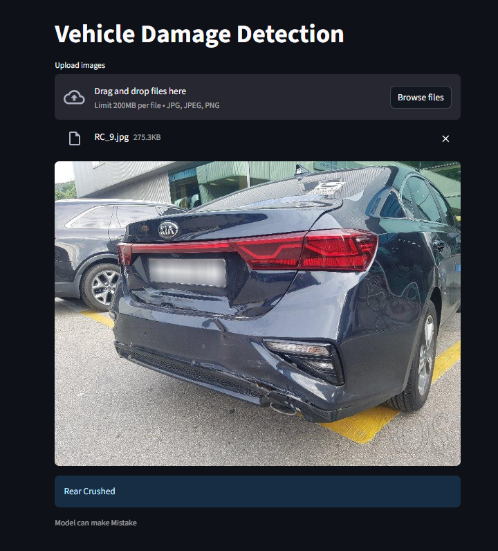
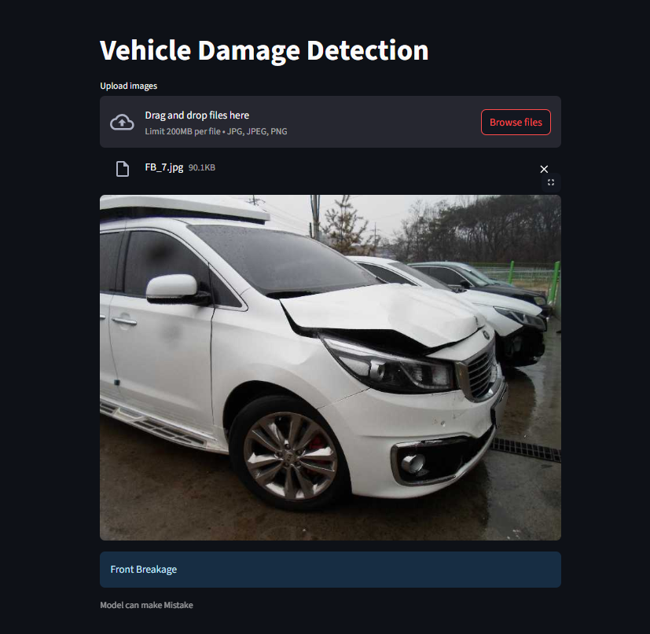

# Project Report 

---
## Car Damage Detection
This is a **Car Damage Detection App** built using **Streamlit** and **ResNet50**.  
This can help users and companies to classify the damage into categories just by having the image of vehicle image. It can classify the vehicle damage into six categories.


---
## Model Details 

1. Model was trained on 2300 labelled car images dataset.
2. It can classify the damage into six categories:
   - Front Normal
   - Front Breakage
   - Front Crushed
   - Rear Normal 
   - Rear Breakage
   - Rear Crushed
3. The model uses transfer learning approach with pre-trained weights of ResNet50.
4. The accuracy on validation set was around 80%.
5. Trained on diverse amount of data having different contrast, rotation and colour jitter.
---
## Tech Stack
- **Backend**: Python, Pytorch, Torch Vision
- **Deployment**: Streamlit Cloud
- **Other Tools**: Scikit-learn, Matplotlib, Optuna

---
## Project Structure
``` text
Car-Damage-Detection/
│
├── backend/           # stores fast-api backend
│   ├── server.py    
│
├── model/            #Trained Model 
│   ├── car_model.pth      
│
├── Screenshots/                
│   ├── img1      #Positive Review
│   ├── img2      #Negative Review
│
├── app.py           # streamlit frontend
│  
├── prediction.py           # predict function and model call
│  
├── requirements.txt            # Python dependencies
├── LICENSE                     # Apache 2.0 license
└── README.md                   # Project documentation
```


---
## How to run locally

1. Clone the repo:
``` bash
git clone https://github.com/itsmoksh/Car-Damage-Detection.git
cd Car-Damage-Detection
```
2. Install Dependencies:
``` bash
pip install -r requirements.txt
```
3. Run the app:
``` bash
streamlit run app.py
```
---

## Screenshots


Model shows Rear Crushed damage.
---


Model shows Front Breakage damage.
---

## Live App

Check out the **live demo**:  
[Streamlit Cloud Link](#) *(https://car-damage-detection-kbb9n2acbfmrcx3fqe7rlc.streamlit.app/)*

##  Author

**Moksh Jain**  
Aspiring Data Scientist | Python & ML Enthusiast  
[LinkedIn](https://www.linkedin.com/in/itsmoksh/) • [GitHub](https://github.com/itsmoksh)
  


